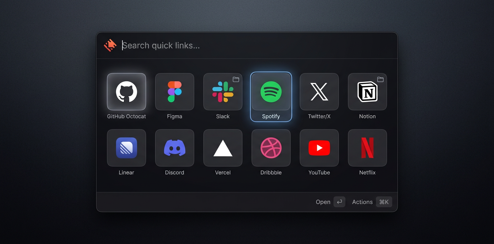

# Boring Quick Links



A Raycast extension for managing and quickly opening URLs, files, folders, and apps through an emoji-picker-style grid interface. Think Raycast Quicklinks, but with **nested containers** and a visual grid layout.

## Features

- **Grid UI** — Visual grid of quicklinks with icons and labels (6 columns)
- **Nested Containers** — Any quicklink can be a container that groups related links inside it, nestable infinitely
- **Smart Search** — Multi-word search across all items including nested ones. Searching "git neuro" finds "Neurofactor" inside the "GitHub" container
- **Frecency Sorting** — Items sort alphabetically initially, then most-used items float to the top
- **Brand Icons** — 3000+ brand SVG icons via [Simple Icons](https://simpleicons.org/) with customizable colors
- **Auto Favicons** — High-res favicons auto-detected from URLs via [icon.horse](https://icon.horse)
- **Move Between Containers** — Move any quicklink to a different container or back to root
- **Import / Export** — Backup and restore your quicklinks as JSON via clipboard
- **Launch Argument** — Search directly from Raycast's global search bar

## Commands

| Command | Description |
|---|---|
| **Browse Quick Links** | Open the quicklinks grid. Accepts an optional search argument |
| **Add Quick Link** | Add a new quicklink via form |
| **Import / Export Quick Links** | Import or export all data as JSON |

## Keyboard Shortcuts

| Key | Action |
|---|---|
| `Enter` | Open link / Drill into container |
| `Cmd + Enter` | Open container's URL (if set) |
| `Esc` | Pop back to parent |
| `Cmd + E` | Edit quicklink |
| `Cmd + N` | Add link inside container |
| `Cmd + Shift + M` | Move to another container |
| `Cmd + Shift + C` | Copy URL |
| `Ctrl + X` | Delete (with confirmation) |

## Icon Types

| Type | Description | Example |
|---|---|---|
| **Auto (Favicon)** | High-res favicon from URL | Auto-detected from `https://github.com` |
| **Brand (SVG)** | Simple Icons SVG, theme-aware | `github`, `figma`, `slack`, `spotify` |
| **Emoji** | Any emoji character | `🚀`, `📁`, `🔥` |
| **Raycast Icon** | Built-in Raycast icons | `Globe`, `Folder`, `Code`, `Star` |
| **Image URL** | Custom image URL | `https://example.com/icon.png` |

Each icon can have a custom **color** from a curated palette (Red, Orange, Yellow, Green, Teal, Blue, Purple, Pink, White, Gray).

## Data Model

A quicklink is a single type with an optional container toggle:

```typescript
interface QuickLink {
  id: string;
  name: string;
  url?: string;          // URL, file path, or folder path
  icon?: ItemIcon;       // emoji, brand, raycast icon, favicon, or image URL
  color?: string;        // hex color for icon tint
  isContainer?: boolean; // toggle to make it a container
  children?: QuickLink[];// nested items when container
  keywords?: string[];   // extra search terms
  useCount?: number;     // frecency tracking
  lastUsedAt?: number;
}
```

Containers are just quicklinks with `isContainer: true`. They can have a URL (opened via `Cmd + Enter`) and hold child quicklinks inside them.

## Storage

Data is stored as a JSON file at `~/.config/raycast/extensions/boring-quicklinks/quicklinks.json` (Raycast's support path). Writes are atomic (write to `.tmp`, then rename) to prevent corruption.

## Development

```bash
# Install dependencies
pnpm install

# Start development
pnpm dev

# Build
pnpm build

# Lint
pnpm lint
```

## License

MIT
